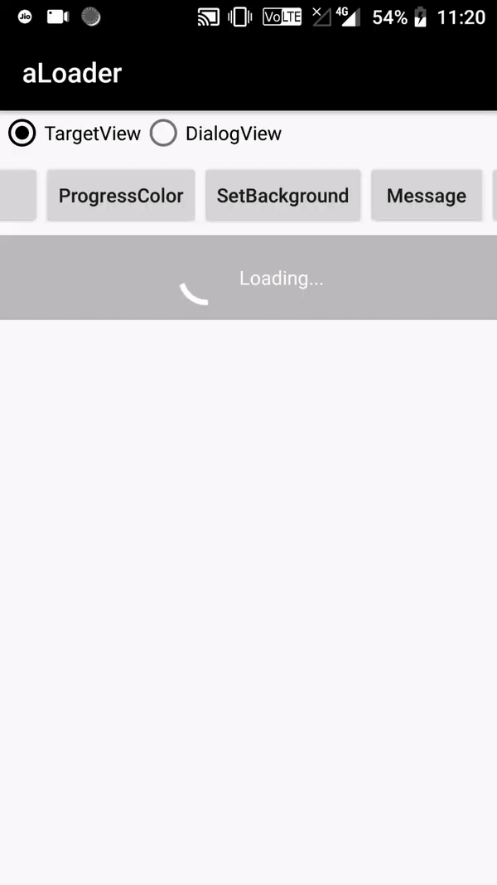
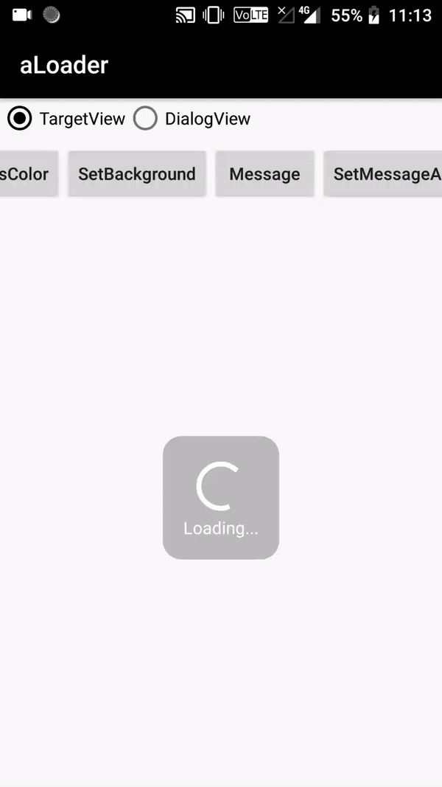
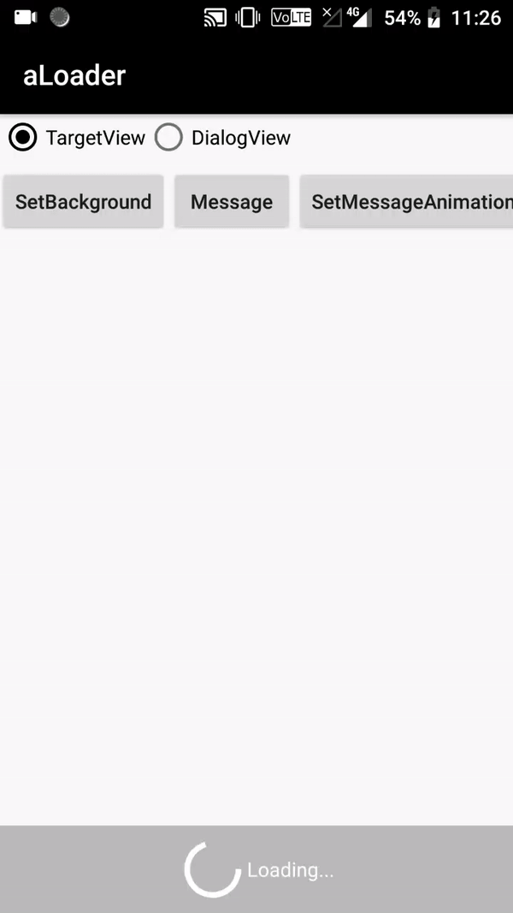
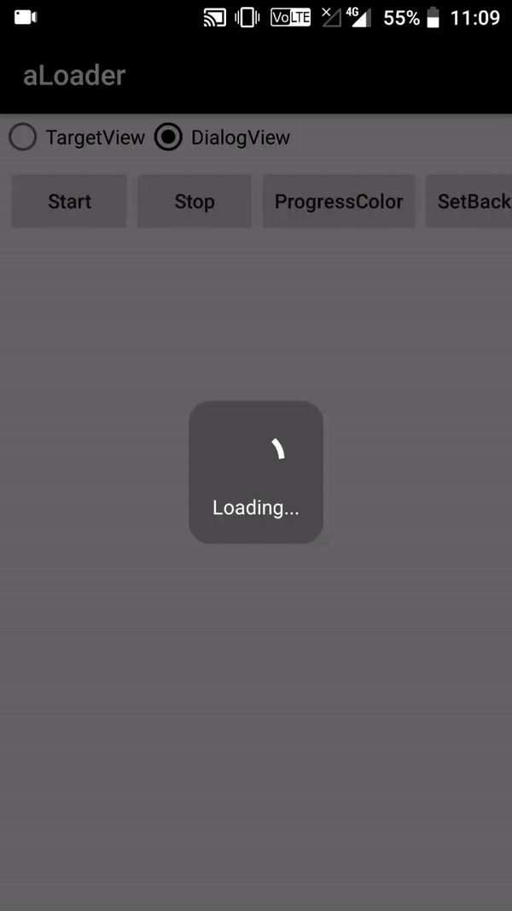

# aLoader
aLoader is simple and lightweight customizable ProgressBar, since ProgressDialog is deprecated and to use ProgressBar we need to include it in xml and refrence it in java and then use it and as ProgressBar is needed in almost every page and to customize it that to if we need any text message to show along its a task so i have made this library to ease the work as this requires only one line of code and you can customize the color of ProgressBar, orientation(top,center,bottom), textSize,textColor, background of the ProgressBar as you like that to at just one line of code. 


#### Types 
You can either **target** any view as you like or directly use **dialogView** where you don't need to pass any view.

#### Screenshot



# Include in your project


Step 1. Add the JitsPack repository to your build file
```
allprojects {
		repositories {
			...
			maven { url 'https://jitpack.io' }
		}
	}
  ```
  Step 2. Add the dependency
```
	dependencies {
		implementation 'com.github.imavinashmaurya:aLoader:v1.0'
	}
  ```
  
  
  # Usage
  
  
  simple code 
  ```
aLoader aLoader = new aLoader().setTargetView(relativeLayout,MainActivity.this,Orientation.BOTTOM).setProgressBarColor(Color.WHITE).message("Loading...",Color.WHITE,TextSize.SMALL).setBackgroundView(ContextCompat.getDrawable(this, R.drawable.backgroundv1));
```
  1. TargetView
  ```
  aLoader aLoader = new aLoader().setTargetView(AnyView, Context, Orientation);
  ```
  2. DialogView
  ```
  aLoader aLoader = new aLoader().setDialog(this);

  ```
  To show and hide 
  ```
  aLoader.start();
  aLoader.stop();
  ```
  To change ProgressBarColor
  ```
  .setProgressBarColor(int color);
  ```
  To set message 
  ```
  .message(String message, int textColor,TextSize textSize);
  here TextSize is already defined in library you can choose TextSize.SMALL,TextSize.MEDIUM,TextSize.LARGE.
  ```
  To change background of the ProgressBar
  ```
  .setBackgroundView(Drawable drawable);
  You can pass any drawable you like but i have given two drawables in library that you can use .
  ContextCompat.getDrawable(this, R.drawable.backgroundv1)
  ContextCompat.getDrawable(this, R.drawable.backgroundv2)
  ```
 To make dailog ProgressBar cancelable or not
 ```
 .setDialogCancelable(boolean cancelable);
 ```

# Developed By

 **Avinash Maurya**
 dev.avinashmaurya1.0@gmail.com 
 
 # License
 aLoader is avialable under MIT license. See the [LICENSE](LICENSE) file for more info.
